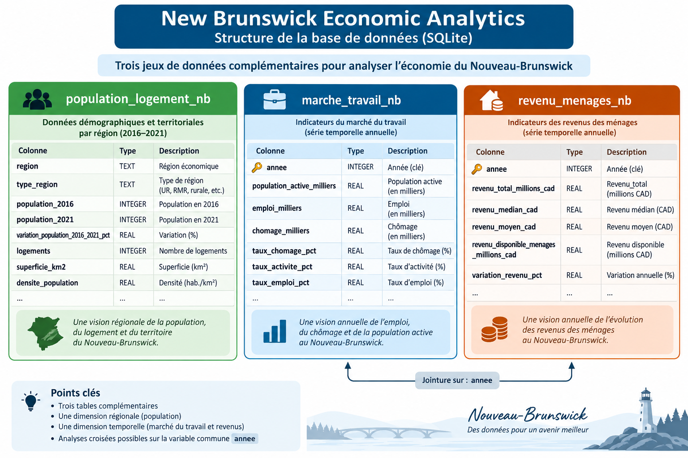
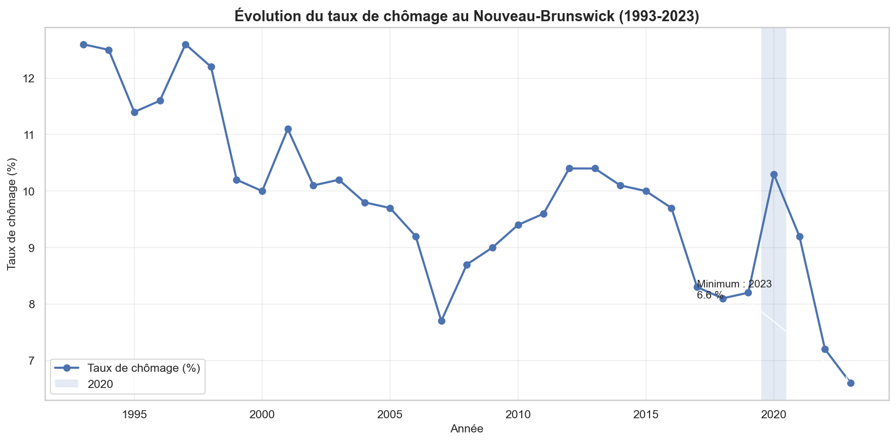
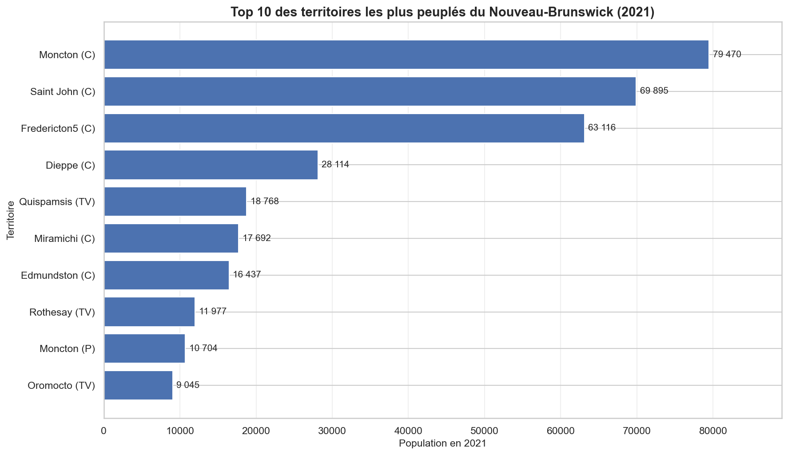
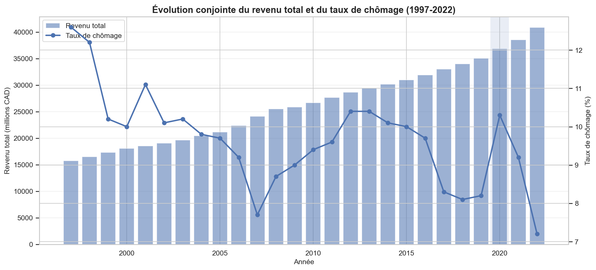
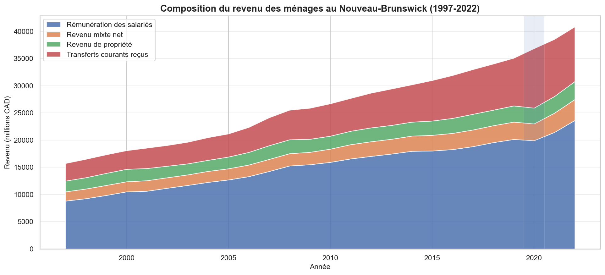

# 📊 New Brunswick Economic Analytics

**Analyse socio-économique du Nouveau-Brunswick avec SQL et Python**


---

## 📖 À propos du projet

Ce projet analyse plusieurs dimensions **économiques et démographiques du Nouveau-Brunswick, Canada**, à partir de trois jeux de données.

L'analyse porte sur :

- 🏘️ **Population et logement** — population, croissance démographique, densité et logements ;
- 💼 **Marché du travail** — emploi, chômage et activité entre 1993 et 2023 ;
- 💰 **Revenus des ménages** — rémunération, transferts et revenu total entre 1997 et 2022.

L'objectif est d'utiliser **SQL et Python** pour structurer les données, contrôler leur qualité, identifier les tendances de long terme, croiser plusieurs indicateurs et communiquer les résultats à travers des visualisations.

---

## 🎯 Objectifs

- Importer et structurer plusieurs jeux de données dans **SQLite**
- Effectuer des contrôles de qualité des données
- Réaliser des analyses SQL de complexité croissante
- Croiser les données du marché du travail et des revenus
- Comparer différents types de territoires
- Produire des visualisations avec Python
- Transformer les résultats techniques en conclusions compréhensibles

---

## 🛠️ Compétences techniques

### SQL

- `SELECT`, `WHERE`, `ORDER BY`, `LIMIT`
- `GROUP BY`
- `SUM()`, `AVG()`, `COUNT()`, `MIN()`, `MAX()`
- `CASE WHEN`
- `JOIN`
- Common Table Expressions (`WITH`)
- Fonctions fenêtres
- `LAG()`
- `RANK()`
- `PARTITION BY`
- Calculs de ratios et de variations

### Python

- **Pandas** — manipulation et interrogation des données
- **sqlite3** — connexion Python / SQLite
- **Matplotlib** — visualisation
- **Seaborn** — mise en forme des graphiques
- **Jupyter Notebook** — analyse reproductible et documentation

---

## 🗄️ Structure des données

La base analytique contient trois tables principales :

| Table | Description | Période / contenu |
|---|---|---|
| `population_logement_nb` | Population, superficie, densité et logements | Recensements 2016 et 2021 |
| `marche_travail_nb` | Population active, emploi et chômage | 1993–2023 |
| `revenu_menages_nb` | Revenus et transferts des ménages | 1997–2022 |

### Schéma de la base



---

## 📓 Contenu du notebook

Le notebook principal est organisé en **8 parties** :

| Partie | Analyse |
|---|---|
| **1** | Création de la base SQLite et import des données |
| **2** | Contrôle qualité des données |
| **3** | Analyse démographique |
| **4** | Analyse du marché du travail |
| **5** | Croisement marché du travail × revenus |
| **6** | Analyse territoriale avancée |
| **7** | Synthèse générale et recommandations |
| **8** | Visualisations avec Python |

➡️ **Notebook principal :** `NewBrunswick_Economic_Analytics.ipynb`

---

# 📊 Principaux résultats

## 1. Évolution du chômage

Le taux de chômage présente une tendance générale à la baisse sur la période étudiée.

Il passe de **12,6 % en 1993 à 6,6 % en 2023**, ce dernier niveau étant le minimum de la série.

L'année 2020 se distingue par une hausse du chômage de **8,2 % en 2019 à 10,3 % en 2020**, suivie d'une diminution au cours des années suivantes.



---

## 2. Population des principaux territoires

Après exclusion des comtés (`CT`) afin d'éviter de mélanger différents niveaux géographiques, **Moncton, Saint John et Fredericton** occupent les trois premières positions parmi les territoires les plus peuplés en 2021.

- **Moncton : 79 470 habitants**
- **Saint John : 69 895 habitants**
- **Fredericton : 63 116 habitants**



---

## 3. Croisement chômage × revenu

Sur la période commune **1997–2022**, le revenu total des ménages passe de **15 728 à 40 862 millions CAD**, soit une progression d'environ **160 %**.

Le chômage présente davantage de fluctuations.

L'année **2020** est particulièrement intéressante : le chômage augmente de **8,2 % à 10,3 %**, alors que le revenu total continue de progresser de **35 084 à 36 854 millions CAD**.

Les deux indicateurs doivent donc être analysés conjointement sans en déduire directement une relation causale.



---

## 4. Composition du revenu

La **rémunération des salariés** constitue la principale composante du revenu sur l'ensemble de la période étudiée.

Les transferts courants représentent :

- **25,0 % du revenu total en 2019**
- **29,7 % en 2020**
- **27,2 % en 2021**
- **24,6 % en 2022**

L'année 2020 se caractérise ainsi par une modification particulièrement importante de la composition du revenu.



---

## 🗺️ Analyse territoriale

L'analyse régionale met en évidence de fortes différences entre les types de territoires.

Les villes (`C`) présentent une densité moyenne de **322,11 habitants/km²**, contre seulement **6,33 habitants/km²** pour les paroisses (`P`).

Parmi les villes, **Moncton** présente la densité la plus élevée avec **564,9 habitants/km²**.

Après exclusion des territoires comptant moins de 100 habitants en 2016, les plus fortes croissances démographiques observées comprennent :

| Territoire | Type | Croissance 2016–2021 |
|---|---:|---:|
| St. Basile 10 | IRI | +72,4 % |
| Red Bank 4 | IRI | +29,4 % |
| Cambridge-Narrows | VL | +27,2 % |

---

## ⚠️ Limites méthodologiques

Cette analyse est principalement **descriptive**. Les associations observées entre plusieurs indicateurs ne permettent pas, à elles seules, d'établir des relations causales.

La structure géographique nécessite également des précautions : certains comtés (`CT`) englobent d'autres unités présentes dans les données. Ils ont donc été exclus de certaines agrégations afin de limiter les doubles comptages.

Enfin, les périodes disponibles diffèrent :

- marché du travail : **1993–2023**
- revenus : **1997–2022**

Les analyses croisées emploi-revenu portent donc sur la période commune **1997–2022**.

---

## 📁 Fichiers du dépôt

```text
NewBrunswick-Economic-Analytics/
│
├── NewBrunswick_Economic_Analytics.ipynb
│
├── population_logement_nb.csv
├── marche_travail_nb.csv
├── revenu_menages_nb.csv
│
├── database_schema.png
├── chomage_evolution.png
├── top10_population.png
├── croisement_revenu_chomage.png
├── composition_revenu.png
│
└── README.md
```

---

## 🚀 Exécuter le projet

### 1. Cloner le dépôt

```bash
git clone https://github.com/Abdoulkarim81/NewBrunswick-Economic-Analytics.git
cd NewBrunswick-Economic-Analytics
```

### 2. Installer les principales bibliothèques

```bash
pip install pandas matplotlib seaborn jupyter
```

### 3. Lancer Jupyter

```bash
jupyter notebook
```

Puis ouvrir :

```text
NewBrunswick_Economic_Analytics.ipynb
```

---

## 🔭 Pistes d'amélioration

Le projet pourrait être prolongé par :

- une analyse géographique plus fine ;
- l'intégration de données sectorielles ;
- une analyse statistique des relations entre chômage et revenus ;
- des modèles de séries temporelles ;
- un dashboard **Power BI** ;
- une comparaison avec d'autres provinces canadiennes.

---

## 👤 Auteur

**Dr. Abdoulkarim Ibrahim Ahmed**

Projet Data Analytics réalisé avec **SQL, SQLite, Python, Pandas, Matplotlib et Seaborn**.

---

## 📚 Sources des données

Les données utilisées dans ce projet proviennent de **Statistique Canada** et portent sur la démographie, le marché du travail et les revenus des ménages au Nouveau-Brunswick.

---

⭐ Ce dépôt fait partie de mon portfolio de projets en **Data Analytics / Data Science**.
